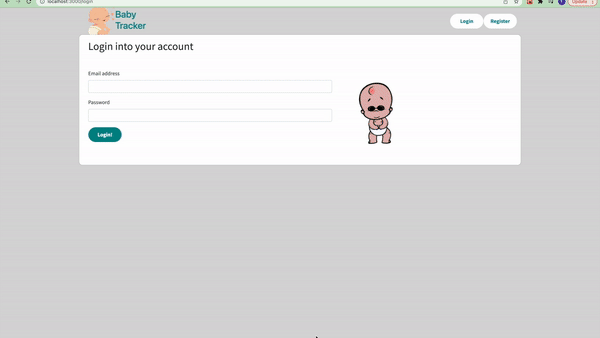

BabyTracker - final project for Lighthouse Labs bootcamp
======

Baby Tracker offers a simple streamlined way to track baby's daily habits, health, and vitals

# Tech stack
Node JS
Express
React
PostgreSQL 

# Server Setup

Install dependencies with npm install.
Run with npm start

# Client Setup

Install dependencies with npm install
Go to localhost:3000 to use application.
